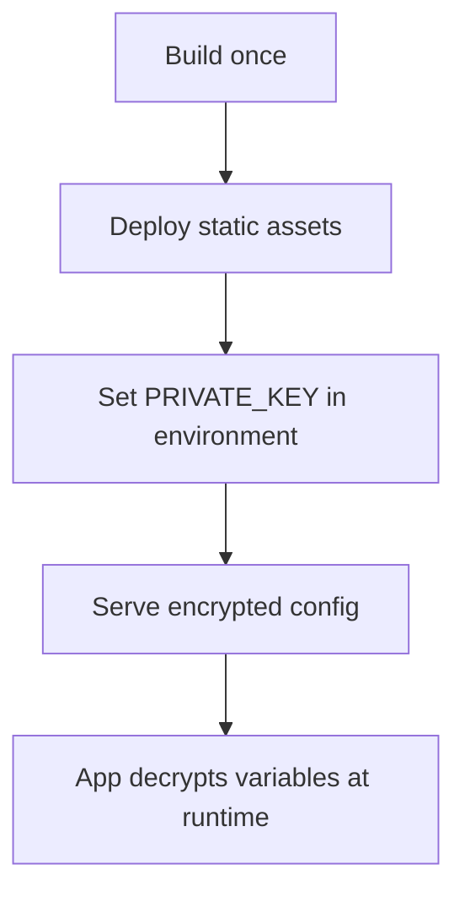

# 🔐 Build-Env

**Secure runtime environment variables for frontend applications — without build-time replacement.**

`build-env` allows frontend apps (React, Vite, etc.) to **load environment variables at runtime** using encrypted configuration, enabling **one build for multiple environments**.

---

## 🚀 Problem

Frontend frameworks normally:
- Replace env variables **at build time**
- Require **rebuilding for each environment**
- Expose values directly in the JS bundle

Browsers cannot read `.env` files at runtime.

---

## ✅ Solution

`build-env` introduces a **secure runtime env system** using encryption:

- 🔒 Encrypted env config
- ⚙️ Runtime loading (post-build)
- 🔁 No rebuilds per environment
- 🛡️ No plaintext env values in bundle

---

## 🧠 How It Works

1. Generate a **public/private key pair**
2. Store the **private key** securely in `.env`
3. Encrypt environment variables into a config file
4. Load & decrypt envs **at runtime**
5. Access variables using a `get()` method

---

## 📦 Installation

```bash
npm install @bhargavratnala/build-env
```

## 🪜 Step-by-Step Usage

Step 1: Generate Encryption Keys

```bash
npx build-env generate
```


This generates:
```text
private_key        # Private key (DO NOT COMMIT)
public_key.pem     # Public key used for encryption
```

## Step 2: Store Private Key in .env

Add the private key and config path to your .env file:

```env
VITE_PRIVATE_KEY=your_private_key_here
VITE_BUILD_ENV_CONFIG=/build-env.config
```


> ⚠️ Never commit the private_key file or private key value.

## Step 3: Build Encrypted Environment Config

```bash
npx build-env build
```


This command:

Encrypts all environment variables

Generates an encrypted config file

Saves it inside the `public/directory`

Example:

public/build-env.config

## Step 4: Load Environment Variables at Runtime

Add this code at the root of your application (before rendering the app):

```js
const [ready, setReady] = useState(false);

useEffect(() => {
  async function init() {
    await loadEncryptedEnv(
      import.meta.env.VITE_PRIVATE_KEY,
      import.meta.env.VITE_BUILD_ENV_CONFIG
    );
    setReady(true);
  }

  init();
}, []);
```

Ensure the app renders only after envs are loaded:

```js
if (!ready) return null;
```

## Step 5: Access Environment Variables

Use the get method provided by build-env anywhere in your app:

```js
import { get } from "build-env";

const apiUrl = get("API_URL");
const appMode = get("APP_MODE");
```

✔ No process.env
✔ No build-time replacement


## 🧩 Supported Frameworks

✅ React (CRA, Vite)

✅ Vite-based frameworks

✅ Any SPA that supports runtime JavaScript loading

## 🔒 Security Notes

All environment variables are encrypted

The private key is never shipped in the build

Suitable for:
- API URLs
- Feature flags
- Public keys
- Environment identifiers

> ❌ Do not store secrets such as database credentials or private tokens.

## 🏗️ Deployment Workflow


## Works well with:

- Docker
- Kubernetes
- Netlify
- Vercel
- Nginx / CDN hosting

## 🎯 When to Use build-env

Use build-env if you want:
- A single frontend build
- Runtime environment configuration
- No rebuilds per environment
- Secure environment variable handling

## 📄 License

MIT